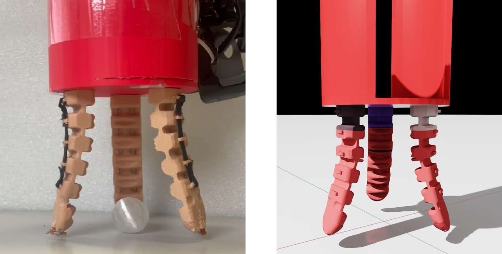
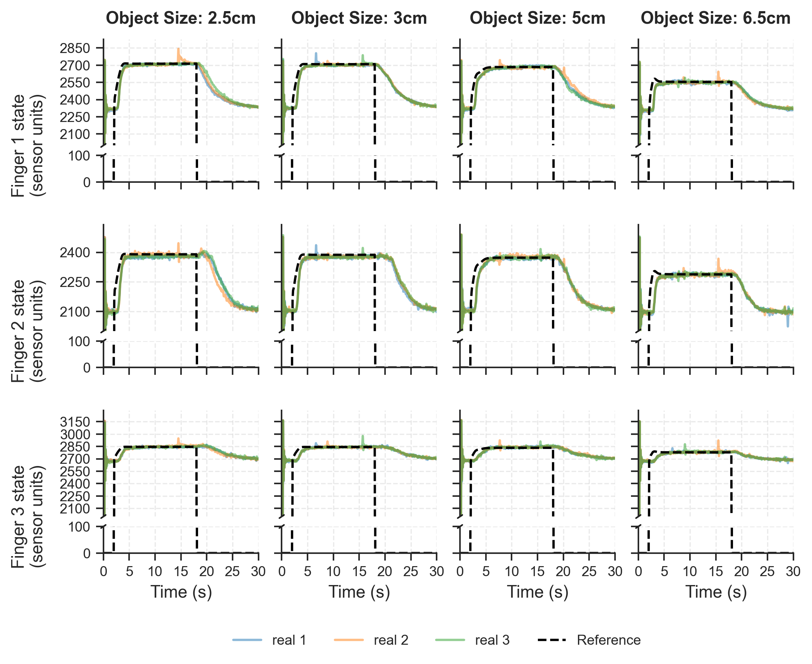

# SMOSMAG: A Low-Cost Modular Reconfigurable Soft SMA Actuated Gripper

[](https://isaac-sim.github.io/IsaacLab/)
[](https://www.python.org/)

**SMOSMAG** (Smart MOdular SMA-actuated Gripper) is a research platform designed for reproducible and inclusive research on the intelligent control of soft robotic grippers. This repository contains the hardware designs, simulation environments, and Reinforcement Learning (RL) control framework for the modular gripper actuated by Shape Memory Alloy (SMA).

<p align="center">
  
  <br>
  <em>Figure 1: Real-world (left) and simulated (right) SMOSMAG experimental setups.</em>
</p>

## 🚀 Key Features

- **Low-Cost & Modular:** A 3-finger configuration costs ~166 EUR. The design is 3D-printed (FilaFlex 82A) and easily reconfigurable (2 to 5 fingers).
- **Physics-Informed Control:** A custom actuator model that captures SMA thermodynamics, hysteresis, and dynamic delay, improving modelling accuracy by up to 8.9x.
- **Intrinsic Reward Decomposition:** An RL control strategy that leverages intrinsic motivation to prevent undesired exploration of pushing the objects away.
- **Sim-to-Real:** Policies trained entirely in Isaac Sim tested on the physical hardware across various object sizes (very small 2.5cm to 6.5cm).

## 🧠 Physics-Informed Actuator Model

The custom actuator model bridges the real-to-sim and sim-to-real gaps by explicitly modeling the complex thermodynamic effects of SMA wires. The controller introduces **dynamic latency** and **asymmetric tapering** to simulate heating delays and hysteresis.

### 1. Dynamic Delay Mapping
To account for the time required for the SMA to accumulate thermal energy, a dynamic delay $\tau_t$ based on the normalized joint error is introduced $\bar{e}_t$:

$$\bar{e}_t = \max_{j \in J_a} \left( \text{clamp}\left( \frac{|q^d_{t,j} - q_{t,j}|}{R_{j,\max}}, 0, 1 \right) \right)$$

$$\tau_t = \lfloor \bar{e}_t (\tau_{\max} - \tau_{\min}) + \tau_{\min} \rceil$$

### 2. Asymmetric Tapering (Hysteresis)
To simulate the passive cooling phase (opening), a fractional power law scaled by a tapering coefficient $c$ is applied:

$$\hat{q}^d_t = \begin{cases} q_t + c \cdot \text{sgn}(\tilde{e}_t) |\tilde{e}_t|^{0.7}, & \text{if } v_t < 0 \\ \tilde{q}^d_t, & \text{if } v_t \geq 0 \end{cases}$$

where $\tilde{e}_t$ is the delayed error and $v_t$ is the joint velocity.

## 🛠 Hardware Specifications

| Component | Detail |
|-----------|--------|
| **Actuators** | Double-wire SMA configuration (58N theoretical, 6.5N at fingertip) |
| **Material** | FilaFlex 82A (Thermoplastic Elastomer) |
| **Sensors** | Embedded piezoresistive flexion and force sensors |
| **Controller** | STM32F4 microcontroller with custom power stage |
| **Weight** | ~210g (3-finger configuration with electronics) |

## 💻 Installation

### Prerequisites
- Install **Isaac Lab** by following the [installation guide](https://isaac-sim.github.io/IsaacLab/main/source/setup/installation/index.html).

### Setup
1. Clone this repository separately from your Isaac Lab installation:
   ```bash
   git clone https://github.com/AIFORS/sma_fingers
   cd sma_fingers
   ```

2. Install the library in editable mode:
   ```bash
   # Use 'PATH_TO_isaaclab.sh -p' instead of 'python' if Isaac Lab is not in your global path
   python -m pip install -e source/three_fingers
   ```

3. Verify installation by listing available tasks:
   ```bash
   python scripts/list_envs.py
   ```
   You should see `Isaac-Three-Fingers-Grasp-RL-v0` in the list.

## 🏃 Usage

### Training the RL Policy
To train the grasping policy using PPO and RSL_RL:
```bash
python scripts/rsl_rl/train.py --task Isaac-Three-Fingers-Grasp-RL-v0 --headless
```

### Using the Policy
To run the trained policy:
```bash
python scripts/rsl_rl/play.py --task Isaac-Three-Fingers-Grasp-RL-v0
```

### Additional evaluation Scripts
We provide standalone scripts for specific evaluations:
- **Plots for real-to-sim grasping:** `python run_three_fingers_big_sphere.py` and `python run_three_figners_small_sphere.py`
- **Plots and videos of RL policy:** `python run_three_fingers_rl_policy.py --checkpoint /path/to/model.pt`

## 📊 Results

The physics-informed controller significantly reduced the sim-to-real gap by explicitly modeling the thermodynamic effects of SMA fingers. The trained in simulation control policy was tested both in simulation and real world and enabled robust grasping. For comprehensive details, please refer to the paper.

<p align="center">
  
  <br>
  <em>Figure 2: Successful zero-shot sim-to-real grasping of objects with various sizes.</em>
</p>

## 📝 Citation

If you find this work useful in your research, please cite:

```bibtex
@misc{SMOSMAG,
  title={A Low Cost Modular Reconfigurable Soft SMA Actuated Gripper with Intrinsic Reward Decomposition RL control},
  author={Sivtsov, Vladimir and Shkolnik, Daniil and Papanikolaou, Athanasios and Markovic, Ivan and Petrovic, Ivan and Zereik, Enrica and Nazarie, Horia-Petru and Copaci, Dorin and Moreno, Luis and Bonsignorio, Fabio},
  year={2026},
  howpublished={\url{https://github.com/vsivtsov/three_fingers}},
  note={GitHub repository}
}
```

## 🙏 Acknowledgments
This work was supported by the H2020 project AIFORS under Grant Agreement No 952275 \hl{and from the project "FotoArt 5.0-CM, Laboratorios Inteligentes para la Ciencia del Futuro: Descubrimiento de materiales avanzados para Fotosintesis Artificial - TEC-2024/TEC-308", funded by the Programas de Actividades I+D en Tecnologias de la Comunidad de Madrid.}